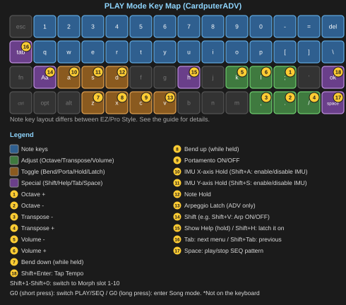

# C.P.S. Quick Start Guide

**C.P.S. (CardPuter Synth)** is a DIY synthesizer firmware that runs on the M5Stack Cardputer / Cardputer ADV.

This guide is meant to be the shortest possible path from powering on your device to making your first sound and trying the basic controls. For a complete walkthrough of every feature, see the **Reference Guide**.

---

## 1. Power On

Power on your Cardputer with C.P.S. flashed onto it, and a microSD card inserted that already has a `/CPS` folder on it (where settings, patches, patterns, and songs are stored).

After the boot screen, the **PLAY screen** appears automatically. This is C.P.S.'s "home screen."

> If something seems clearly wrong — no sound at all, the keyboard not responding — check "10. Troubleshooting" first.

---

## 2. Make Your First Sound

On C.P.S.'s keyboard, **the number row (`1` through `0`, `-`, `=`) is one octave.** Try pressing `1` through `=` in order — you'll hear a rising scale.

- **Number row (row 1):** the higher octave
- **`q` through `]` (row 2):** one octave down

> **C.P.S. is a monophonic (single-voice) synth.** Pressing multiple keys at once will never produce a chord (overlapping tones) — only one note ever sounds at a time. You can still press several keys simultaneously (the original Cardputer has a limit on how many keys it can register at once; Cardputer ADV can register more), but that's mainly used for **specifying a chord for the Arpeggio (ARP) feature**, covered later.

---

## 3. The Basics

These are the essential keys for shaping the sound while you play.

| Key | Function |
|---|---|
| `;` / `.` | Octave up / down |
| `,` / `/` | Transpose (semitones) |
| `k` / `l` | Volume down / up (hold to change quickly) |
| `Z` / `X` | Pitch bend down / up |
| `C` | Portamento (glide) on/off |
| `D` | Note Hold (keeps sounding after you release the key) |

These work the same way on the PLAY, SEQ, and SONG screens.

### IMU (tilt the device to play)

Cardputer ADV has a built-in tilt sensor (IMU).

| Key | Function |
|---|---|
| `A` | Hold the X-axis value |
| `S` | Hold the Y-axis value |
| `Shift+A` | Enable/disable the X-axis itself |
| `Shift+S` | Enable/disable the Y-axis itself |

Tilting the device left/right and forward/back responds, by default, with the X-axis controlling pitch bend and the Y-axis controlling brightness (Shape). Which parameter each axis controls is fully customizable from the SETTING menu, introduced later.



---

## 4. Shape the Sound

The tabs along the top of the screen cycle with `Tab` (forward) and `Shift+Tab` (back).

```
PLAY / SEQ -> VCO -> VCF -> VCA -> LFO -> FX -> SETTING -> (back to PLAY / SEQ)
```

Here's what each tab does, in brief:

- **VCO**: the source of the sound — waveform, brightness (Shape), detune, a second oscillator, sub-oscillator, noise
- **VCF**: the filter (how muffled or bright/sharp the sound is)
- **VCA**: the volume envelope (how the note starts and fades)
- **LFO**: slow, periodic modulation (vibrato, tremolo, and more) applied to other parameters
- **FX**: stack multiple effects — Ring Modulator, Bitcrusher, Soft Limiter, Chorus, Delay, Reverb
- **SETTING**: everything else related to playing — portamento speed, play style, ARP, patterns, screen appearance, MIDI, Theremin, and more

Inside any tab, use `;`/`.` to select an item and `,`/`/` to adjust its value (hold to change quickly).

> **Feel free to experiment.** No matter how much you change the sound, `Tab` into **SETTING > Patch > Reset** and you can always get back to a clean default (a confirmation screen means you won't reset by accident). More on this in the next section.

---

## 5. Save and Load Patches

Sounds you create can be saved to the SD card as "patches."

Press `Tab` into the **SETTING** tab, then choose **Patch** at the top — this takes you to a screen for saving, loading, renaming, duplicating, and deleting patches.

### Reset — Getting Back to a Clean Sound

On the same screen, **Reset** puts the VCO, VCF, VCA, LFO, and IMU settings back to their defaults. A confirmation screen means it won't happen by accident. **Unsaved changes are lost** — but that also means: as long as you haven't saved, you can always safely start over. A good workflow is to experiment freely first, then save as a patch once you find something you like.

There's also a **Randomize** feature here, useful when you want a starting point or some inspiration.

---

## 6. Morphing

C.P.S. lets you register **up to 10 patches into "Morph slots"** and switch between them instantly — or blend between them smoothly — while you play.

`Shift+1` through `Shift+0` (ten slots: 1-9 and 0) switch to the corresponding slot. Whether switching is instant or gradual is set from SETTING > Patch > Morph.

Which patch is assigned to which slot is also set from that same screen.

---

## 7. Rhythm — ARP, SEQ, and SONG

C.P.S. has three features for automating and sequencing your playing. Full details are in the Reference Guide; here's just the entry point.

- **Arpeggio (ARP)**: toggle with `Shift+V`. Hold down a chord and it's automatically played back as a broken chord.

  Cardputer's keys are small, and it's easy to think you're pressing one down when it isn't fully registered. When using ARP, the `V` key's **Latch** feature is worth using — with Latch on, you don't need to keep holding the keys down; the chord you last held keeps sounding after you let go. **If you're trying ARP for the first time, we'd especially recommend turning Latch on first.**
- **Step Sequencer (SEQ)**: the `G0` button switches between PLAY and SEQ. Program 16-step patterns.
- **Song (SONG)**: hold `G0` to enter SONG mode, where you arrange SEQ patterns into a full song.

Need to match a tempo quickly? `Shift+Enter` gives you **Tap Tempo** (on the PLAY and SEQ screens).

---

## 8. Sharing Patches

C.P.S. patch files live in the `/CPS/Patch` folder on the SD card. Just copy the file to share a sound with another C.P.S. user.

---

## 9. Want to Go Further?

- **Theremin-style playing**: connect a distance sensor (ToF) unit (M5Stack Unit ToF4M) and play by moving your hand through the air
- **MIDI**: connects with external MIDI gear (note send/receive, pitch bend, clock sync, and more)
- **Custom IMU mapping**: fine-tune exactly which tilt controls which parameter

All of this is covered in detail in the **Reference Guide**.

---

## 10. Troubleshooting

### Try Help first

Hold `H` during play to show the list of key commands available on the current screen. Press `Shift+H` to lock (latch) it in place (press `Shift+H` again to release it).

### If the keyboard stops responding

Very rarely — often after fast key-presses — **the keyboard may stop responding entirely.** This isn't a bug in C.P.S.'s software; it's a **known hardware quirk of the Cardputer ADV's keyboard chip itself (the TCA8418).**

If this happens, **C.P.S. detects it automatically and restarts on its own within about 30 seconds** to recover. Just wait — there's nothing you need to do.

> In very rare cases, this automatic recovery could trigger by mistake while you're holding one very long, sustained note. If the device restarts unexpectedly mid-performance, that's most likely what happened.

### Still stuck?

Check that the SD card is properly seated and making contact, and that the firmware was flashed correctly. If the problem persists, reach out via a GitHub Issue or contact the developer, [@Tokagetchi](https://twitter.com/Tokagetchi).

---

*C.P.S. is an independently developed DIY synthesizer. Enjoy playing it.*
