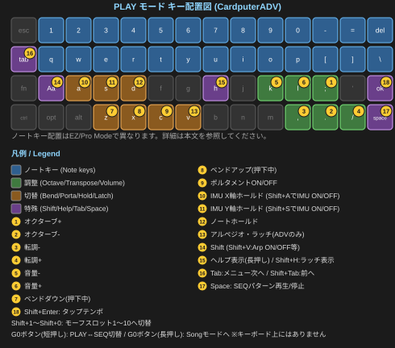

# C.P.S. クイックスタートガイド

**C.P.S.（CardPuter Synth）** は、M5Stack Cardputer / Cardputer ADV 上で動作する、DIYシンセサイザーファームウェアです。

このガイドは、初めてC.P.S.に触れる方が、電源を入れてから最初の音を出し、基本的な操作を一通り体験できるようになるまでを、できるだけ短くまとめたものです。全機能を網羅した詳しい説明は「リファレンスガイド」を参照してください。

---

## 1. 起動する

microSDカードに `/CPS` フォルダ（設定・パッチ・パターン・ソングの保存先）が作られた状態で、C.P.S.のファームウェアを書き込んだCardputerの電源を入れます。

起動画面のあと、自動的に **PLAY画面** が表示されます。これがC.P.S.の「ホーム画面」です。

> 何も音が出ない・キーボードが反応しないなど、明らかにおかしいと感じたら、まず「10. 困ったときは」を確認してください。

---

## 2. 最初の音を出す

C.P.S.のキーボードは、**数字キーの並び（`1`〜`0`、`-`、`=`）が1オクターブ**になっています。試しに `1` から `=` まで順番に押してみてください。ドレミファソラシドのように音階が鳴ります。

- **数字キーの行（1段目）**：高いオクターブ
- **`q`から`]`までの行（2段目）**：1オクターブ下

> **C.P.S.はモノフォニック（単音）シンセです。** 複数のキーを同時に押しても、和音（音の重なり）として鳴ることはなく、常に1つの音だけが鳴ります。複数キーの同時押し自体は可能ですが（オリジナルCardputerは同時に認識できるキー数に制限があり、Cardputer ADVはより多くのキーを同時に認識できます）、これは主に後述する**アルペジオ（ARP）機能で和音を指定するため**に使います。

---

## 3. 基本操作

演奏しながら音を調整するための、基本のキーです。

| キー | 内容 |
|---|---|
| `;` / `.` | オクターブを上げる／下げる |
| `,` / `/` | トランスポーズ（半音単位） |
| `k` / `l` | 音量を下げる／上げる（長押しで素早く変化） |
| `Z` / `X` | ピッチベンド（下げる／上げる） |
| `C` | ポルタメント（グライド）のON/OFF |
| `D` | ノートホールド（鍵盤を離しても音を保持） |

これらはPLAY画面だけでなく、SEQ画面やSONG画面でも共通して使えます。

### IMU（本体を傾けて操作する）

Cardputer ADVには傾きセンサー（IMU）が内蔵されています。

| キー | 内容 |
|---|---|
| `A` | X軸の値を保持（Hold） |
| `S` | Y軸の値を保持（Hold） |
| `Shift+A` | X軸そのものを無効化／有効化 |
| `Shift+S` | Y軸そのものを無効化／有効化 |

本体を左右・前後に傾けると、初期状態ではX軸がピッチベンド、Y軸が音の明るさ（Shape）に反応します。どのパラメータに反応するかは、あとで紹介するSETTINGメニューから自由に変更できます。



---

## 4. 音を作る

画面上部のタブは、`Tab`キーで次へ、`Shift+Tab`で前へ移動できます。

```
PLAY / SEQ → VCO → VCF → VCA → LFO → FX → SETTING → （PLAY / SEQへ戻る）
```

各タブでできることの概要です。

- **VCO**：波形の選択、音の明るさ（Shape）、デチューン、第2オシレーター、サブオシレーター、ノイズなど、音の「元」を作ります
- **VCF**：フィルター（音のこもり具合・鋭さ）を調整します
- **VCA**：音量エンベロープ（音の立ち上がりと消え方）を調整します
- **LFO**：ゆっくりした周期的な変化（ビブラートやトレモロなど）を、他のパラメータにかけます
- **FX**：リングモジュレーター・ビットクラッシャー・リミッター・コーラス・ディレイ・リバーブなど、複数のエフェクトを重ねてかけられます
- **SETTING**：ポルタメントの速さ、演奏スタイル、ARP、パターン、画面の見た目、MIDI、テルミンなど、演奏に関わる細かい設定はここにまとまっています

各タブの中では、`;`/`.`で項目を選び、`,`/`/`で値を増減させます（長押しで素早く変化します）。

> **いろいろ音を触ってみてください。** どれだけ音を変えても、`Tab`で**SETTING > Patch > Reset**を選べば、いつでも基本の音に戻せます（確認画面が出るので、うっかり戻ってしまう心配もありません）。詳しくは次の章で説明します。

---

## 5. パッチを保存する・呼び出す

作った音は「パッチ」としてSDカードに保存できます。

`Tab`を押して **SETTING** タブに入り、一番上の **Patch** を選ぶと、パッチの保存・読み込み・名前変更・複製・削除ができる画面に移動します。

### 音を基本に戻す（Reset）

同じ画面にある **Reset** を選ぶと、VCO・VCF・VCA・LFO・IMUの設定を、すべて初期状態に戻せます。確認画面が表示されるので、意図せず戻ってしまうことはありません。**保存していない変更は失われます**が、逆に言えば「保存さえしなければ、いつでも安心してやり直せる」ということです。まずは気軽に音をいじって、気に入ったらパッチとして保存する、という流れがおすすめです。

ここには **Randomize**（ランダムに音を作る）機能もあります。気に入った音の手がかりが欲しいときに試してみてください。

---

## 6. モーフィング機能

C.P.S.には、**最大10個のパッチを「モーフスロット」に登録し、演奏中に瞬時に切り替えたり、なめらかに変化させたりできる**機能があります。

`Shift+1`〜`Shift+0`（1〜9、0の10個）で、登録したスロットへ切り替わります。切り替え方法（即座に切り替えるか、じわっと変化させるか）は SETTING > Patch > Morph から設定できます。

どのパッチをどのスロットに割り当てるかも、同じ画面から設定します。

---

## 7. リズムを演奏する — ARP・SEQ・SONG

C.P.S.には、演奏を自動化・パターン化する3つの機能があります。詳しい使い方はリファレンスガイドに譲り、ここでは入り口だけ紹介します。

- **アルペジオ（ARP）**：`Shift+V` でON/OFF。和音を押さえると、自動的に分散和音として演奏されます

  Cardputerのキーは小さく、押しているつもりでもしっかり押せていないことがあります。ARPを使うときは `V` キーの**ラッチ（Latch）機能**を活用すると便利です。ラッチをONにすると、鍵盤を押しっぱなしにしなくても、指を離した後の和音がそのまま鳴り続けます。**特にARPを初めて試す方は、まずラッチをONにして試してみることをおすすめします。**
- **ステップシーケンサー（SEQ）**：`G0` ボタンでPLAYとSEQを切り替えます。16ステップの打ち込みができます
- **ソング（SONG）**：`G0` を長押しすると、SEQのパターンを並べて曲を組み立てるSONGモードに入ります

テンポを素早く合わせたいときは、`Shift+Enter` で**タップテンポ**が使えます（PLAY・SEQ画面）。

---

## 8. パッチを共有する

C.P.S.のパッチファイルは、SDカードの `/CPS/Patch` フォルダに保存されます。このファイルをそのままコピーすれば、他のC.P.S.ユーザーと音を共有できます。

---

## 9. もっと知りたくなったら

- **テルミン風演奏**：距離センサー（ToF）ユニット（M5Stack Unit ToF4M）を接続すると、手をかざして音程を操作する演奏ができます
- **MIDI**：外部MIDI機器との連携（ノート送受信、ピッチベンド、クロック同期など）に対応しています
- **IMUの割り当て変更**：どの傾きがどのパラメータに反応するかは、細かくカスタマイズできます

これらの詳しい設定方法は、**リファレンスガイド**にまとめてあります。

---

## 10. 困ったときは

### まずHelp機能を

演奏中、`H`キーを押している間、その画面で使えるキー操作の一覧が表示されます。`Shift+H`を押すと、表示したままロック（ラッチ）できます（もう一度`Shift+H`で解除）。

### キーボードが反応しなくなったら

ごく稀に、キーを速く連打したときなどに、**キーボード入力が一切反応しなくなることがあります。** これはC.P.S.のソフトウェアの不具合ではなく、**Cardputer ADVのキーボードチップ（TCA8418）自体が持つ、既知のハードウェア上の癖**です。

この状態になった場合、**C.P.S.は自動的に検知し、最大30秒程度で自動的に再起動して復帰します。** 何もせず、そのままお待ちください。

> ごく稀に、非常に長く1つの音を伸ばして演奏しているときに、この自動復帰が誤って作動してしまう可能性があります。もし演奏中に予期せず再起動した場合は、この安全機構が働いたものとご理解ください。

### それでも解決しない場合

SDカードの向き・接触や、ファームウェアの書き込み状態を確認してください。それでも改善しない場合は、GitHubのIssueや、開発者（@Tokagetchi）までご連絡ください。

---

*C.P.S.は個人開発のDIYシンセサイザーです。ぜひ演奏を楽しんでください。*
