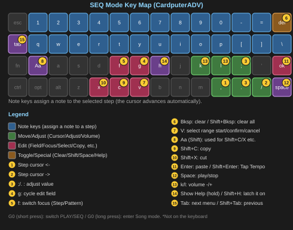
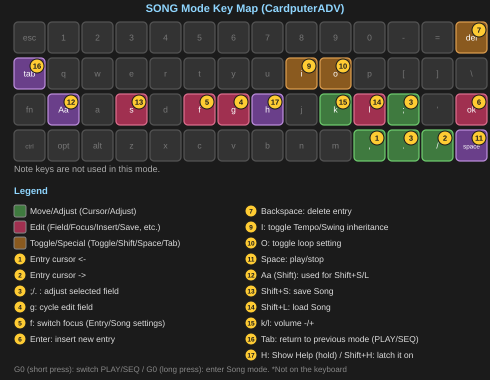

# C.P.S. Reference Guide

This is the complete reference for every feature in **C.P.S. (CardPuter Synth)**. If you're new, we recommend starting with the **Quick Start Guide** to get the basics, then coming back here to look up specific features.

## Table of Contents

1. [Basics (PLAY Screen)](#1-basics-play-screen)
2. [VCO — Oscillator](#2-vco-oscillator)
3. [VCF — Filter](#3-vcf-filter)
4. [VCA — Amp / Envelope](#4-vca-amp-envelope)
5. [LFO](#5-lfo)
6. [FX — Effects](#6-fx-effects)
7. [SETTING — Settings](#7-setting-settings)
8. [SEQ — Step Sequencer](#8-seq-step-sequencer)
9. [SONG — Song Mode](#9-song-song-mode)
10. [Saving, Sharing, and Morphing Patches](#10-saving-sharing-and-morphing-patches)
11. [MIDI](#11-midi)
12. [Theremin (Distance Sensor)](#12-theremin-distance-sensor)
13. [Help](#13-help)
14. [Index](#14-index)
15. [Troubleshooting](#15-troubleshooting)

---

## 1. Basics (PLAY Screen)

### 1.1 The Keyboard

C.P.S. is a **monophonic (single-voice) synth**. Pressing multiple keys at once is possible, but only one note ever sounds (multiple simultaneous keys are mainly used to specify a chord for ARP).

| Keys | Range |
|---|---|
| `1` `2` `3` `4` `5` `6` `7` `8` `9` `0` `-` `=` | The higher octave (12 notes) |
| `q` `w` `e` `r` `t` `y` `u` `i` `o` `p` `[` `]` | One octave below that (12 notes) |
| `Backspace` | Continues the number row — the highest note overall |

When Play Style is set to **Pro**, this layout is remapped to follow whichever scale is currently selected (see [7.5 Play Style](#75-play-style)).

### 1.2 Performance Keys

| Key | Function |
|---|---|
| `;` / `.` | Octave up / down |
| `,` / `/` | Transpose (semitones) up / down |
| `k` / `l` | Volume down / up (1% steps, hold to accelerate) |
| `Z` / `X` | Pitch bend down / up |
| `C` | Portamento (glide) on/off |
| `D` | Note Hold (keeps sounding after you release the key) |

### 1.3 IMU (Tilt Sensor, Cardputer ADV only)

| Key | Function |
|---|---|
| `A` | Hold the X-axis (freeze at its current value) |
| `S` | Hold the Y-axis (freeze at its current value) |
| `Shift+A` | Enable/disable the X-axis itself |
| `Shift+S` | Enable/disable the Y-axis itself |

Which parameter each axis controls is set in [7.2 IMU](#72-imu).

#### Original Cardputer (No IMU): Using PAD Instead

On the original Cardputer, which has no IMU, a **virtual pad (PAD)** offers equivalent X-axis/Y-axis control.

| Key | Function |
|---|---|
| `,` / `/` | PAD X-axis |
| `;` / `.` | PAD Y-axis |
| `A` / `S` | Hold the PAD (same as IMU Hold) |

**PAD moves in discrete steps via key presses**, unlike the IMU's continuous tilt sensing — it's not suited to a slow, continuous sweep the way tilting is. For the exact key assignments on your hardware, the on-screen Help (`H` key) is authoritative too.

### 1.4 Arpeggio and Latch

| Key | Function |
|---|---|
| `Shift+V` | Arpeggio (ARP) on/off |
| `V` | Latch on/off (only active while ARP is on) |

See [7.6 Arp](#76-arp) for details.

### 1.5 Morphing and Tempo

| Key | Function |
|---|---|
| `Shift+1` through `Shift+0` | Switch to Morph slot 1-10 |
| `Shift+Enter` | Tap Tempo (works on PLAY and SEQ) |

See [10.4 Morphing](#104-morphing) for details.

### 1.6 Navigation

| Key | Function |
|---|---|
| `Tab` | Next tab (VCO->VCF->VCA->LFO->FX->SETTING->PLAY/SEQ) |
| `Shift+Tab` | Previous tab |
| `G0` (physical button) | Switch between PLAY and SEQ |
| `G0` (long press) | Enter SONG mode |
| `H` (hold) | Show Help |
| `Shift+H` | Latch Help on (press again to release) |

### 1.7 Differences on the Original Cardputer

C.P.S. detects the hardware automatically at boot and also runs on the original Cardputer (the model without an IMU). A few things differ from the Cardputer ADV, though.

- **PAD instead of IMU**: see [1.3 IMU](#13-imu-tilt-sensor-cardputer-adv-only) for details
- **Octave/transpose keys move**: since PAD input takes over `;`/`.`/`,`/`/`, Octave moves to `J`/`N` and Transpose to `B`/`M`
- **Deadzone and Calibrate are hidden**: a key-based PAD has no concept of sensor noise or physical drift, so these settings simply don't appear in the menu
- **Arpeggiator isn't supported**: it relies on holding multiple keys down at once to specify a chord, and the original's 3-key rollover limit (below) makes that unreliable, so it's left unsupported
- **Step Sequencer, Pattern Bank, and Song mode all work on both**: since notes are entered one step at a time, the rollover limit doesn't affect them
- **3-key rollover limit**: due to hardware constraints, pressing a 4th key at the same time may cause key ghosting
- **The automatic keyboard recovery feature doesn't apply**: the keyboard-freeze quirk covered in [15. Troubleshooting](#15-troubleshooting) is specific to the Cardputer ADV's keyboard chip (TCA8418). The original Cardputer reads its keyboard a different way and isn't affected by this particular issue

---

## 2. VCO — Oscillator

This tab sets the waveform at the source of the sound. Use `;`/`.` to select an item and `,`/`/` to change its value.

| Item | Function |
|---|---|
| Osc (waveform) | The active waveform (see below) |
| Timbre | Position within the Morph chain (linked to morphing, covered later) |
| Shape | Continuously reshapes the waveform (e.g. duty cycle on a square wave, slope on a sawtooth) |
| Detune / Fine | Main oscillator detune (coarse / fine) |
| Vibrato Depth / Rate | Periodic pitch modulation |
| Sub Level / Octave | Sub-oscillator volume and octave |
| Noise | Amount of noise blended in |
| Osc2 Mix | Blend ratio with the second oscillator |

### 2.1 Waveforms

C.P.S. includes 12 waveforms.

**Basic**: Sine, Triangle, Sawtooth, Square

**Shaped**: Wavefolder (folds the waveform back on itself), HalfSine (half-wave rectified sine), Parabolic (a triangle with rounded corners), ESaw (an accelerating ramp)

**Phase-distortion**: Squeeze (an asymmetrically compressed sine), ESquare (a smoothly rounded square), Saw2 (a different asymmetric sawtooth), Square2 (Squeeze-style distortion combined with tanh drive)

Every waveform is band-limited (anti-aliased). You may notice a slight ripple in some waveforms, especially square-ish ones — that's the intentional trade-off that keeps high notes from sounding noisy.

### 2.2 Shape

The Shape parameter has a different effect depending on the waveform. On a square wave, Shape=0 gives a narrow pulse, Shape=50% a symmetric square, and Shape=100% a wide pulse — smoothly sweeping the duty cycle. Every other waveform is designed to reshape smoothly across its own Shape range too.

### 2.3 Second Oscillator (Osc2)

A second oscillator, independent from the main one — its own waveform, octave, and detune — can be layered in. Osc2 Mix sets how much it blends with the main oscillator.

---

## 3. VCF — Filter

Shapes how muffled or bright/sharp the sound is.

| Item | Function |
|---|---|
| Cutoff | Cutoff frequency |
| Resonance | Resonance (strength of the peak at cutoff) |
| Filter Type | Filter type |
| Key Tracking | How much cutoff automatically follows pitch |
| Env Depth | How deeply the filter envelope affects cutoff |
| Env Attack/Decay/Sustain/Release | The filter's own dedicated envelope |

A graph on screen shows the filter's current response curve.

---

## 4. VCA — Amp / Envelope

Sets how volume changes over time (the envelope), plus tremolo.

| Item | Function |
|---|---|
| Attack | How fast the note rises |
| Decay | How fast it falls from peak to the sustain level |
| Sustain | Volume while a key is held |
| Release | How fast the note fades after release |
| Tremolo Depth | Depth of periodic volume modulation |

A graph on screen shows the envelope shape.

> **A patch with Sustain set to 0** (a decaying, percussive sound like Piano) will fade naturally from whatever level it was at, even if you release the key partway through Decay.

---

## 5. LFO

Applies slow, periodic modulation to other parameters.

| Item | Function |
|---|---|
| Wave | LFO waveform (Sine/Triangle/Sawtooth/Square/Sample & Hold) |
| Rate | Speed of the cycle |
| Depth | How much modulation is applied |
| Target | Which parameter it modulates |

LFO targets span pitch, volume, filter cutoff, and Shape, all the way through to individual FX parameters.

---

## 6. FX — Effects

Stack multiple effects together. Use `,`/`/` to select a pad, `Enter` to toggle it on/off, and `.` to open that effect's own parameter screen (`Tab` returns to the pad selector).

| Effect | Main parameters | Description |
|---|---|---|
| Ring Mod | Rate, Mix | Ring modulator — adds a metallic, inharmonic character |
| Soft Limiter | Drive, Mix | Soft saturation, raises perceived loudness |
| Chorus | Rate, Depth, Mix | Adds thickness and movement |
| Delay | Time, Feedback, Mix | Echo repeats |
| Reverb | Room, Damping, Mix | Adds spatial ambience |
| Bitcrush | Amount | Reduces bit depth for a gritty, digital texture |

Setting any effect's Mix to 0 effectively turns it off. Once turned off, its previous Mix level is remembered for the rest of the session and restored when you turn it back on (this is forgotten on power-off).

**Parameters that IMU/LFO can modulate**: Ring Mod (Rate/Mix), Soft Limiter (Drive), Chorus (Depth/Mix), Delay (Feedback/Mix), Reverb (Room/Mix). Chorus Rate and Delay Time are excluded for sound-quality reasons.

---

## 7. SETTING — Settings

Entering the SETTING tab shows a list of categories. Use `;`/`.` to select one and `Enter` (or `/`) to open it.

### 7.1 Patch

Save, load, rename, duplicate, and delete patches; Morph (Morph slot assignment); and Randomize (random patch generation) all live here. See [10. Saving, Sharing, and Morphing Patches](#10-saving-sharing-and-morphing-patches) for details.

### 7.2 IMU

Playing controls driven by Cardputer ADV's tilt sensor.

- **X-axis / Y-axis target**: which parameter each axis controls (pitch bend, volume, Shape, filter cutoff, and many FX parameters are all available)
- **Sensitivity**
- **Invert**
- **Curve**: response curve (linear, exponential, etc.)

The offset the IMU applies is **added** to the patch's own value — it never overwrites the patch value outright.

On the original Cardputer (no IMU), a virtual pad (PAD) offers similar control instead. See [1.3 IMU](#13-imu-tilt-sensor-cardputer-adv-only) for the exact key assignments and limitations.

### 7.3 Bend

Settings for pitch bend via the `Z`/`X` keys — bend range (in cents), and attack/release speed.

> Bend is not saved with the patch. It's treated as a performance setting and carries over when you switch patches.

### 7.4 Portamento

Sets the speed of portamento (glide), toggled with the `C` key.

> Portamento is also not saved with the patch — it's a performance setting too.

### 7.5 Play Style

- **EZ**: fixed to the major scale — a simple layout for beginners
- **Pro**: choose freely from 49 scales across 9 categories. Picking one from the scale picker remaps the keyboard to that scale's notes

#### Drift (a bonus feature)

This page also shows **Drift** (ON/off) and **Amount** (0-100%), but only while Pro Style is active. It's a playful recreation of the instability old analog synths had.

- **Pitch** wanders slightly (up to roughly 9 cents at most — any more and it stops sounding like an old synth's character and just sounds out of tune, so the range is deliberately capped)
- **Filter cutoff** breathes, moving slowly on its own
- **Volume** creeps gradually

The three move independently of each other (if they all moved together, it would just sound like a monotonous tremolo). **The on-screen knobs themselves don't move — only the sound does**, matching how a real analog synth behaves. Turning it off returns smoothly to the original state with no interruption in sound.

A note appears at the bottom of the screen while it's on. **Drift is treated as a performance-style setting rather than part of the tone itself, so — like Play Style and Scale — it isn't saved with the patch** (see [10.3 Sharing Patches](#103-sharing-patches)).

### 7.6 Arp

Settings for the arpeggiator (automatic broken chords).

| Item | Function |
|---|---|
| Type | Up, down, up-down, order played, random, and more |
| Tempo | Tempo (1-unit steps, hold to accelerate) |
| Rate | Length of one step |
| Swing | Swing (rhythmic "bounce") |

Toggle with `Shift+V`, and toggle Latch with `V`. With Latch on, the chord you were last holding keeps sounding even after you lift your fingers off the keys. **Cardputer's keys are small, and it's easy for a press to go unrecognized — if you're trying ARP for the first time, Latch is worth using.**

Tempo, Swing, and Rate each have their own independent value on the PLAY screen versus SEQ. ARP and Portamento settings are, like Bend, never saved with the patch — they're performance settings.

### 7.7 Pattern

Only shown when viewed from the SEQ screen — settings for the pattern bank (covered below).

### 7.8 Screen

UI theme (5 options), screen brightness, and other display settings.

### 7.9 MIDI / MIDI Out / MIDI In

Settings for connecting to external MIDI gear. See [11. MIDI](#11-midi) for details.

### 7.10 Theremin

Settings for non-contact playing using a distance sensor (ToF) unit (M5Stack Unit ToF4M). See [12. Theremin](#12-theremin-distance-sensor) for details.

---

## 8. SEQ — Step Sequencer

`G0` switches between PLAY and SEQ. Program 16-step patterns here.

### 8.1 Basics

| Key | Function |
|---|---|
| `,` / `/` | Move the cursor |
| Note keys | Assign a note to the selected step + preview it + advance the cursor automatically |
| `Backspace` | Clear the step |
| `Shift+Backspace` | Clear the entire pattern |
| `Space` | Play/stop |
| `f` | Switch focus |
| `;`/`.` | Adjust/toggle the value |
| `g` | Switch which field is being adjusted |

### 8.2 STEP vs. PATTERN Editing

`f` switches between two edit focuses: **STEP** (that step's Velocity, Tie, Slide, Accent) and **PATTERN** (the whole pattern's Tempo, Swing). `g` toggles between the two fields within whichever focus is active.

- **Velocity**: 1-unit steps, hold to accelerate
- **Tie**: extends the previous note (no retrigger, pitch unchanged)
- **Slide**: glides smoothly from the previous pitch (no retrigger)
- **Accent**: briefly emphasizes velocity and filter cutoff

### 8.3 Copy and Paste

| Key | Function |
|---|---|
| `V` | Select (mark) a step |
| `Shift+C` | Copy |
| `Shift+X` | Cut |
| `Enter` | Paste |

### 8.4 Pattern Bank

Patterns you create can be saved to the "Pattern Bank" — 8 banks x 8 slots (`/CPS/Pattern`). Access it via SETTING > Pattern. There's also a random pattern generator.

---

## 9. SONG — Song Mode

Long-press `G0` to enter SONG mode, where you arrange SEQ patterns in sequence to build a full song.

### 9.1 Basics

| Key | Function |
|---|---|
| `,` / `/` | Move the entry cursor |
| `f` | Switch focus (entry / whole-song settings) |
| `g` | Switch which field is being edited |
| `;`/`.` | Adjust the field's value |
| `Enter` | Insert a new entry (copies the current Bank/Slot) |
| `Backspace` | Delete an entry |
| `k`/`l` | Volume |

### 9.2 Per-Entry Settings

Each entry lets you choose which pattern (Bank/Slot) plays, at what transpose, and how many times it repeats.

### 9.3 Whole-Song Settings

| Key | Function |
|---|---|
| `Space` | Play/stop the song |
| `Shift+S` | Save the song |
| `Shift+L` | Load a song |
| `I` | Toggle whether Tempo/Swing come from each pattern or the whole song |
| `O` | Toggle looping at the end |

Songs are saved to `/CPS/Song`.

---

## 10. Saving, Sharing, and Morphing Patches

### 10.1 Saving and Loading Patches

SETTING > Patch lets you save, load, rename, duplicate, and delete patches. Patch files are saved to the `/CPS/Patch` folder.

### 10.2 Reset — Getting Back to a Clean Sound

SETTING > Patch > **Reset**, after a confirmation screen, puts the VCO, VCF, VCA, LFO, and IMU settings back to their defaults. **Unsaved changes are lost**, but whenever you've tweaked a patch into a state you can't make sense of, this is always there to safely start over.

> Bend ([7.3](#73-bend)) and Portamento ([7.4](#74-portamento)) are handled separately from patches, so each has its own dedicated Reset on its own settings screen.

### 10.3 Sharing Patches

Patch files are plain text and can simply be copied to share a sound with another C.P.S. user. A patch only stores settings **that belong to the sound itself** — settings like ARP, Portamento, and Bend, and Play Style, Scale, and Drift (see [7.5 Play Style](#75-play-style)), which relate to playing style rather than tone, are never included (they live on the device instead, and carry over when you switch patches).

If you load a patch made on a newer version of C.P.S. into an older one, any settings it doesn't recognize are simply ignored (no error occurs).

### 10.4 Morphing

Register up to 10 patches into "Morph slots" and recall them instantly with `Shift+1` through `Shift+0`. SETTING > Patch > Morph is where you assign which patch goes in which slot.

Setting **Morph Time** to something other than 0 makes switching gradual rather than instant, taking the time you specify. Setting it to 0 makes switching instant.

Switching to the slot that's already selected produces no change in value, so the sound doesn't change either.

### 10.5 Randomize

SETTING > Patch > Randomize generates a random sound. ARP, Portamento, and Bend settings aren't part of a patch, so they're excluded from randomization too.

---

## 11. MIDI

Connect external MIDI gear for playing or control. This requires a separately sold serial MIDI unit (M5Stack Unit Midi) (USB MIDI was ruled out for technical reasons).

### 11.1 Messages Received

- Note On / Off
- Pitch Bend
- Sustain pedal (CC64)
- Mod wheel (CC1, controls vibrato depth)
- Program Change (can be assigned to switch Morph slots)
- All Notes Off / All Sound Off
- Custom CC (2 slots, assignable to any parameter)
- Custom switches (2 slots)
- MIDI Clock (syncs tempo with external gear)

### 11.2 Messages Sent

- Note + velocity
- Pitch bend
- IMU movement, sent as CC
- Program Change
- MIDI Clock

### 11.3 Connecting

The serial MIDI unit has **two ports: MIDI IN and MIDI OUT.** Which one you connect depends on which direction you're using C.P.S. in.

#### To receive (play C.P.S. from an external MIDI keyboard)

Connect a cable from the external MIDI keyboard or controller's MIDI OUT port to the **MIDI unit's MIDI IN port**. The external gear's notes and controls will then be reflected according to C.P.S.'s MIDI In settings.

#### To send (have C.P.S. drive external gear or sync a DAW)

Connect a cable from the **MIDI unit's MIDI OUT port** to the external sound module's or DAW's MIDI IN port. Notes you play on C.P.S., along with anything enabled in MIDI Out settings, are sent to the external gear.

> Receiving and sending can both be active at once. For two-way communication, connect both the MIDI IN and MIDI OUT ports to their corresponding ports on the other device.

#### About the switch on the unit itself (Bypass / Separate)

The M5Stack Unit Midi has a switch on its front panel with two modes, **Bypass** and **Separate**. Which one is correct depends on whether you're receiving, sending, or both.

- **Receiving only (playing C.P.S. from external gear)**: either mode works fine. Signal arriving at the MIDI IN port reaches the Cardputer in both modes
- **Sending (having C.P.S. drive external gear or a DAW)**: **you must use Separate mode.** In Bypass mode, MIDI sent from C.P.S. only reaches the unit's onboard sound chip — it never reaches the physical MIDI OUT port at all. This is an easy thing to miss the first time you set this up

If you want both directions at once, Separate mode covers that too.

### 11.4 MIDI Out Settings (Sending)

Configure from SETTING > MIDI > Out.

| Item | Function |
|---|---|
| Note Out | Whether played notes are sent as MIDI notes |
| GM Sound | The GM (General MIDI) program number to send (0-127, 8-unit steps) — tells the receiving sound module which instrument sound to use |
| IMU->CC | Whether IMU (or PAD) movement is sent as CC messages |
| X CC | The CC number used to send IMU X-axis movement |
| Y CC | The CC number used to send IMU Y-axis movement |
| Clock Out | Whether to send MIDI Clock, syncing external gear's tempo to C.P.S. |
| Channel | The MIDI channel used for sending (1-16) |

### 11.5 MIDI In Settings (Receiving)

Configure from SETTING > MIDI > In.

| Item | Function |
|---|---|
| Clock In | Whether C.P.S.'s own tempo syncs to incoming MIDI Clock from external gear |
| CC In | Master switch for the two custom CC inputs (In1, In2) |
| In1 CC / In1 Dest | The CC number custom CC input 1 responds to, and which parameter it controls (the same wide range of choices as IMU/PAD) |
| In2 CC / In2 Dest | Same as In1, for custom CC input 2 |
| Sw1 CC | The CC number custom switch 1 responds to |
| Sw1 Fn | The function assigned to custom switch 1 (choose from Porta, Hold, Arp, or Arp Latch) |
| Sw1 Mode | Custom switch 1's behavior mode (see below) |
| Sw2 CC / Sw2 Fn / Sw2 Mode | Same as Sw1, for custom switch 2 |

**Custom switch Mode** has two options.

- **Moment (momentary)**: on only while you're holding the pedal/pad down, off as soon as you release it
- **Latch**: toggles on/off each time you press it (press once to turn on and stay on, press again to turn off — suited to latching-style pedals)

Custom switches treat a CC value of 64 or above as "pressed" and below 64 as "released." Holding a pedal down won't cause the function to rapidly toggle.

---

## 12. Theremin (Distance Sensor)

Connect a separately sold distance sensor (ToF, Time of Flight) unit (M5Stack Unit ToF4M) for theremin-style, non-contact playing by moving your hand.

### 12.1 Connecting

- Via the **onboard Grove port**, or via a **LoRa Cap** (the Cap connection is more stable)
- While connected, it can't be used alongside a regular MIDI unit (true for the onboard Grove connection; using the LoRa Cap, both can work together)

> **About Grove-expansion units other than LoRa Cap**: M5Stack sells several units besides LoRa Cap that add Grove ports. However, the **Cap-sharing mode** in the SETTING "Bus" option was built after confirming LoRa Cap's own wiring specifically — other manufacturers' or products' Grove-expansion units may wire things differently, and compatibility can't be guaranteed. **Development and testing have only been done with the LoRa Cap the developer personally owns.** If you're using a different unit, try connecting directly to the onboard Grove port first.

### 12.2 Settings

Configure from SETTING > Theremin.

| Item | Function |
|---|---|
| Bus | Connection method (Grove / Cap-shared) |
| Pitch | Pitch mapping mode (Smooth / Semitone) |
| Top | Top of the pitch range |
| Span | Width of the pitch range |

#### Pitch: Smooth vs. Semitone

- **Smooth**: pitch changes continuously with hand position — closer to a real theremin's smooth playability, but harder to land precisely on a target note.
- **Semitone**: automatically snaps hand position to the nearest semitone (or scale note). Harder to play out of tune, and a good choice if you're new to this or want to stay in a precise scale.

**In Semitone mode, when Play Style is set to Pro Style, snapping follows whatever scale is currently selected.** In EZ Style, it's a plain semitone snap (see [7.5 Play Style](#75-play-style)).

#### Top and Span: Setting the Pitch Range

**Top** sets the **upper limit** of the theremin's pitch range. It's adjusted in octave units and is **completely independent** of the keyboard's own octave/transpose settings — whatever octave the keyboard is set to has no effect on the theremin's range.

**Span** sets **how far below that upper limit (Top)** the range extends — 1 to 4 octaves wide. Combining Top and Span lets you freely set exactly the pitch window you want to play in.

Moving your hand closer to the sensor raises the pitch; moving it away lowers it. Volume is controlled by the existing IMU (Y-axis tilt). Moving your hand out of the sensor's range naturally silences the note.

### 12.3 Notes

If the connection becomes temporarily unstable, C.P.S. automatically tries to reconnect. If the unit can't be found for an extended time, it gives up searching (if that happens, turn Theremin back on from the SETTING screen to try again).

---

## 13. Help

Hold `H` during play to show a list of the key commands available on the current screen. `Shift+H` latches it in place (press `Shift+H` again to release). The latch state is shared across PLAY, SEQ, and SONG.

Help is currently only available on the PLAY, SEQ, and SONG screens — it doesn't appear on other screens like VCO.

---

## 14. Index

| Term | See |
|---|---|
| ARP (Arpeggio) | [7.6](#76-arp) |
| Bend (Pitch Bend) | [7.3](#73-bend) |
| Bitcrush | [6.](#6-fx-effects) |
| Chorus | [6.](#6-fx-effects) |
| Delay | [6.](#6-fx-effects) |
| Drift (bonus feature) | [7.5](#75-play-style) |
| FX | [6.](#6-fx-effects) |
| Help | [13.](#13-help) |
| IMU | [7.2](#72-imu) |
| Latch | [7.6](#76-arp) |
| LFO | [5.](#5-lfo) |
| MIDI | [11.](#11-midi) |
| Morph (Morphing) | [10.4](#104-morphing) |
| Original Cardputer | [1.7](#17-differences-on-the-original-cardputer) |
| Osc2 (Second Oscillator) | [2.3](#23-second-oscillator-osc2) |
| Pattern (Pattern Bank) | [8.4](#84-pattern-bank) |
| Play Style | [7.5](#75-play-style) |
| Portamento | [7.4](#74-portamento) |
| Randomize | [10.5](#105-randomize) |
| Reset (return to default sound) | [10.2](#102-reset-getting-back-to-a-clean-sound) |
| Reverb | [6.](#6-fx-effects) |
| Ring Mod | [6.](#6-fx-effects) |
| Scale | [7.5](#75-play-style) |
| SEQ | [8.](#8-seq-step-sequencer) |
| Shape | [2.2](#22-shape) |
| SONG | [9.](#9-song-song-mode) |
| Soft Limiter | [6.](#6-fx-effects) |
| Tap Tempo | [1.5](#15-morphing-and-tempo) |
| Theremin | [12.](#12-theremin-distance-sensor) |
| Tremolo | [4.](#4-vca-amp-envelope) |
| Vibrato | [2.](#2-vco-oscillator) |

---

## 15. Troubleshooting

### No sound

- Check the volume (the `k`/`l` keys, or the current patch's VCA Sustain)
- Check whether ARP or SEQ is on with an empty chord/pattern
- Check whether an FX Mix is set to something extreme

### The keyboard stops responding

Very rarely — often after fast key-presses — **the keyboard may stop responding entirely.** This isn't a bug in C.P.S.'s software; it's a **known hardware quirk of the Cardputer ADV's keyboard chip itself (the TCA8418)** — other engineers working with the same chip have reported the identical behavior independently.

If this happens, **C.P.S. detects it automatically and restarts on its own within about 30 seconds** to recover. Just wait — there's nothing you need to do.

> In very rare cases, this automatic recovery could trigger by mistake while you're holding one very long, sustained note. If the device restarts unexpectedly mid-performance, that's most likely what happened.

### Issues specific to the original Cardputer

The automatic recovery above addresses a quirk specific to the Cardputer ADV's keyboard chip. On the original Cardputer, you might instead see the following (see [1.7 Differences on the Original Cardputer](#17-differences-on-the-original-cardputer) for details).

- **Ghosting when pressing 4 or more keys at once**: caused by the 3-key rollover limit. This tends to show up when reaching for a chord for ARP
- **Some items in the IMU target list don't respond when you tilt**: a few IMU-specific behaviors (Deadzone, Calibrate) simply aren't shown in the menu on the original Cardputer at all. If they're missing, that's expected
- **No Arp menu to be found**: the Arpeggiator isn't supported on the original Cardputer, so its menu doesn't appear on the SETTING screen at all

### The SD card won't read

- Check that it's properly seated and making contact
- If SD reads become unstable while using LoRa Cap, check that the Cap itself is properly seated
- Confirm the card has a `/CPS` folder (with `Patch`/`Pattern`/`Song` subfolders)

### Theremin isn't responding, or is unstable

- Check that your connection method (Grove / Cap) matches the SETTING > Theremin > Bus setting
- Over the onboard Grove connection, it can't be used at the same time as a MIDI unit
- If your hand is outside the sensor's range, silence is the correct behavior, not a bug

### The sound changed after loading a patch / a setting isn't taking effect

- ARP, Portamento, and Bend are device settings, not patch settings — switching patches never changes them (this is intentional)
- Loading a patch made on a newer version into an older one silently ignores settings it doesn't recognize

### Still stuck?

Reach out via a GitHub Issue, or on X (Twitter) at [@Tokagetchi](https://twitter.com/Tokagetchi).

---

*C.P.S. is an independently developed DIY synthesizer. Feedback is always welcome.*
