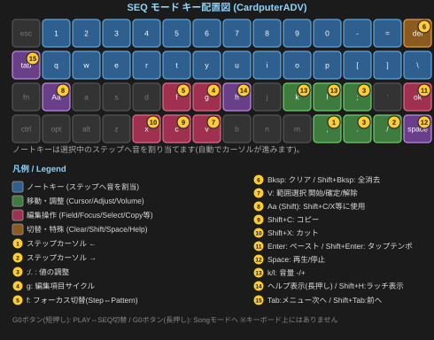
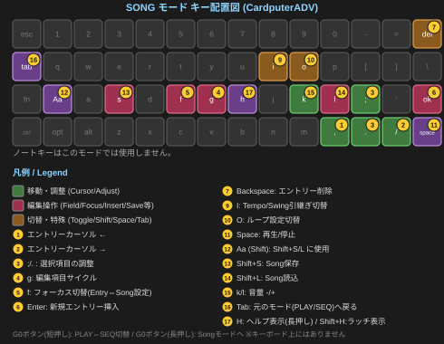

# C.P.S. リファレンスガイド

このガイドは、**C.P.S.（CardPuter Synth）** の全機能を網羅した詳細な説明書です。初めての方は、まず「クイックスタートガイド」で基本を掴んでから、このガイドで気になる機能を調べる使い方をおすすめします。

## 目次

1. [基本操作（PLAY画面）](#1-play)
2. [VCO — オシレーター](#2-vco)
3. [VCF — フィルター](#3-vcf)
4. [VCA — アンプ・エンベロープ](#4-vca)
5. [LFO](#5-lfo)
6. [FX — エフェクト](#6-fx)
7. [SETTING — 各種設定](#7-setting)
8. [SEQ — ステップシーケンサー](#8-seq)
9. [SONG — ソングモード](#9-song)
10. [パッチの保存・共有・モーフィング](#10)
11. [MIDI](#11-midi)
12. [テルミン（距離センサー）](#12_1)
13. [Help機能](#13-help)
14. [索引](#14_1)
15. [トラブルシューティング](#15_1)

---

## 1. 基本操作（PLAY画面）

### 1.1 鍵盤

C.P.S.は**モノフォニック（単音）シンセ**です。複数キーを同時に押すこと自体は可能ですが、鳴るのは常に1音だけです（複数キーの同時押しは、主にARPで和音を指定するために使います）。

| キー | 音域 |
|---|---|
| `1` `2` `3` `4` `5` `6` `7` `8` `9` `0` `-` `=` | 高いオクターブ（12音） |
| `q` `w` `e` `r` `t` `y` `u` `i` `o` `p` `[` `]` | 1オクターブ下（12音） |
| `Backspace` | 数字キー行の続き。全体の中で最も高い音 |

演奏スタイル（Play Style）が **Pro** の場合は、この配置は現在選択されているスケールの音階に沿って再マッピングされます（詳細は [7.5 Play Style](#75-play-style)）。

### 1.2 演奏補助キー

| キー | 内容 |
|---|---|
| `;` / `.` | オクターブを1つ上げる／下げる |
| `,` / `/` | トランスポーズ（半音単位）を上げる／下げる |
| `k` / `l` | 音量を下げる／上げる（1%刻み、長押しで加速） |
| `Z` / `X` | ピッチベンドを下げる／上げる |
| `C` | ポルタメント（グライド）のON/OFF |
| `D` | ノートホールド（鍵盤を離しても音を保持し続ける） |

### 1.3 IMU（傾きセンサー、Cardputer ADVのみ）

| キー | 内容 |
|---|---|
| `A` | X軸のHold（現在の値で固定） |
| `S` | Y軸のHold（現在の値で固定） |
| `Shift+A` | X軸そのものを無効化／有効化 |
| `Shift+S` | Y軸そのものを無効化／有効化 |

X軸・Y軸それぞれにどのパラメータを割り当てるかは [7.2 IMU](#72-imu) で設定します。

#### オリジナルCardputer（IMU非搭載）での代替操作

IMUを搭載していないオリジナルCardputerでは、代わりに**仮想パッド（PAD）**でX軸・Y軸相当の操作ができます。

| キー | 内容 |
|---|---|
| `,` / `/` | PAD X軸 |
| `;` / `.` | PAD Y軸 |
| `A` / `S` | PADのHold（IMUのHoldと同様） |

**PADはキーの押下による段階的な操作**であり、IMUのような連続的な傾きの検出ではありません。そのため、ゆるやかに値を変化させ続けるような表現には向きません。実機でのキー割り当ての詳細は、画面上のHelp（`H`キー）でも確認できます。

### 1.4 アルペジオ・ラッチ

| キー | 内容 |
|---|---|
| `Shift+V` | アルペジオ（ARP）のON/OFF |
| `V` | ラッチ（Latch）のON/OFF（ARPが有効なときのみ機能） |

詳細は [7.6 Arp](#76-arp) を参照してください。

### 1.5 モーフィング・テンポ

| キー | 内容 |
|---|---|
| `Shift+1`〜`Shift+0` | モーフスロット1〜10へ切り替え |
| `Shift+Enter` | タップテンポ（PLAY・SEQ画面で使用可） |

詳細は [10.4 モーフィング](#104) を参照してください。

### 1.6 画面移動

| キー | 内容 |
|---|---|
| `Tab` | 次のタブへ（VCO→VCF→VCA→LFO→FX→SETTING→PLAY/SEQ） |
| `Shift+Tab` | 前のタブへ |
| `G0`（本体ボタン） | PLAYとSEQを切り替え |
| `G0` 長押し | SONGモードへ |
| `H`（押している間） | Help表示 |
| `Shift+H` | Helpをラッチ表示（もう一度で解除） |

### 1.7 オリジナルCardputerとの違い

C.P.S.は起動時にハードウェアを自動判別し、オリジナルCardputer（IMU非搭載モデル）でも動作します。ただし、以下の点がCardputer ADVと異なります。

- **IMUの代わりにPAD操作**：詳細は [1.3 IMU](#13-imucardputer-adv) を参照してください
- **オクターブ／転調キーの変更**：PAD操作（`;`/`.`/`,`/`/`）にキーを譲るため、オクターブは`J`/`N`、転調は`B`/`M`に変更されています
- **Deadzone・Calibrateは非表示**：キー操作によるPADにはセンサーノイズや物理的なズレという概念が無いため、これらの設定項目自体がメニューに表示されません
- **アルペジエーターは非対応**：アルペジエーターは複数キーの同時押しでコードを指定する機能ですが、オリジナルCardputerには後述の同時押し制限があり、安定して動作しないため非対応としています
- **ステップシーケンサー・Pattern Bank・Songモードは両機種で利用可能**：1ステップずつ音を入力する形式のため、同時押し制限の影響を受けません
- **同時押し3キー制限**：ハードウェアの制約により、4キー以上を同時に押すと、キーの誤検出が発生する可能性があります
- **キーボード自動復帰機能は対象外**：[15. トラブルシューティング](#15) で説明しているキーボード入力停止の既知の癖は、Cardputer ADVのキーボードチップ（TCA8418）特有のものです。オリジナルCardputerは異なる方式でキーを読み取っているため、この特定の問題は発生しません

---

## 2. VCO — オシレーター

音の元になる波形を決めるタブです。`;`/`.`で項目を選び、`,`/`/`で値を変更します。

| 項目 | 内容 |
|---|---|
| Osc（波形） | 使用する波形（下記参照） |
| Timbre | Morphチェーン内での波形の位置（後述のモーフィングと連動） |
| Shape | 波形の形状を連続的に変化させます（例: 矩形波ではデューティ比、鋸歯波では傾きなど） |
| Detune / Fine | メインオシレーターのデチューン（粗い／細かい） |
| Vibrato Depth / Rate | ピッチへの周期的な揺れ |
| Sub Level / Octave | サブオシレーターの音量とオクターブ |
| Noise | ノイズ成分の混合量 |
| Osc2 Mix | 第2オシレーターとのミックス比率 |

### 2.1 波形の種類

C.P.S.には12種類の波形が用意されています。

**基本波形**：Sine（サイン波）、Triangle（三角波）、Sawtooth（鋸歯波）、Square（矩形波）

**変形波形**：Wavefolder（波形を折り返す）、HalfSine（半波整流サイン波）、Parabolic（角の丸い三角波）、ESaw（加速するランプ波）

**位相歪み系**：Squeeze（非対称に圧縮されたサイン波）、ESquare（滑らかな矩形波）、Saw2（別の非対称鋸歯波）、Square2（Squeeze系とtanh駆動を組み合わせた矩形波）

すべての波形は帯域制限（エイリアシング対策）が施されています。矩形波などで波形にわずかな波打ち（リップル）が見えることがありますが、これは高音域でのノイズを防ぐための仕様です。

### 2.2 Shape

Shapeパラメータは、波形ごとに異なる効果を持ちます。矩形波の場合は、Shape=0で細いパルス、Shape=50%で左右対称の矩形、Shape=100%で幅広パルスというように、デューティ比をなめらかに変化させます。他の波形も、それぞれ形状が滑らかに変わるよう設計されています。

### 2.3 第2オシレーター（Osc2）

メインオシレーターとは別に、独立した波形・オクターブ・デチューンを持つ第2オシレーターを重ねられます。Osc2 Mixで、メインとどれだけブレンドするかを調整します。

---

## 3. VCF — フィルター

音のこもり具合・鋭さを調整します。

| 項目 | 内容 |
|---|---|
| Cutoff | カットオフ周波数 |
| Resonance | レゾナンス（共鳴の強さ） |
| Filter Type | フィルターの種類 |
| Key Tracking | 音程に応じてカットオフが自動的に変化する度合い |
| Env Depth | フィルターエンベロープがカットオフに与える深さ |
| Env Attack/Decay/Sustain/Release | フィルター専用のエンベロープ |

画面にはフィルターのグラフが表示され、設定した特性を視覚的に確認できます。

---

## 4. VCA — アンプ・エンベロープ

音量の時間変化（エンベロープ）と、トレモロを設定します。

| 項目 | 内容 |
|---|---|
| Attack | 音の立ち上がりの速さ |
| Decay | 最大音量からサステインレベルまで下がる速さ |
| Sustain | 鍵盤を押し続けている間の音量 |
| Release | 鍵盤を離してから音が消えるまでの速さ |
| Tremolo Depth | 音量への周期的な揺れの深さ |

画面にはエンベロープのグラフが表示されます。

> **Sustainを0に設定したパッチ**（Pianoのような減衰型の音）は、Decayの途中で鍵盤を離しても、そのときの音量から自然に減衰していきます。

---

## 5. LFO

ゆっくりとした周期的な変化を、他のパラメータにかけます。

| 項目 | 内容 |
|---|---|
| Wave | LFOの波形（Sine/Triangle/Sawtooth/Square/Sample & Hold） |
| Rate | 周期の速さ |
| Depth | かかる深さ |
| Target | どのパラメータに変化をかけるか |

LFOのターゲットには、ピッチ・音量・フィルターカットオフ・Shapeをはじめ、FXの各パラメータまで幅広く選べます。

---

## 6. FX — エフェクト

複数のエフェクトを重ねてかけられます。`,`/`/`でパッドを選び、`Enter`でON/OFF、`.`でそのエフェクトの詳細設定画面に入ります（`Tab`でパッド選択に戻ります）。

| エフェクト | 主なパラメータ | 内容 |
|---|---|---|
| Ring Mod | Rate, Mix | リングモジュレーター。金属的・非整数倍音の音色を加えます |
| Soft Limiter | Drive, Mix | ソフトなサチュレーション・音圧の底上げ |
| Chorus | Rate, Depth, Mix | 音に厚みと揺らぎを加えます |
| Delay | Time, Feedback, Mix | やまびこのように音を繰り返します |
| Reverb | Room, Damping, Mix | 空間の響きを加えます |
| Bitcrush | Amount | ビット深度を落として、デジタル的にざらついた質感を加えます |

各エフェクトのMixを0にすると、そのエフェクトは実質的にOFFになります。一度OFFにしても、以前設定していたMix量はセッション中は記憶されており、再度ONにすると復元されます（電源を切ると忘れます）。

**IMU・LFOで変調できるパラメータ**：Ring Mod（Rate/Mix）、Soft Limiter（Drive）、Chorus（Depth/Mix）、Delay（Feedback/Mix）、Reverb（Room/Mix）。Chorus RateとDelay Timeは、音質上の理由から変調対象になっていません。

---

## 7. SETTING — 各種設定

SETTINGタブに入ると、カテゴリの一覧が表示されます。`;`/`.`でカテゴリを選び、`Enter`（または`/`）で入ります。

### 7.1 Patch

パッチの保存・読み込み・名前変更・複製・削除、そしてMorph（モーフスロットの設定）と、Randomize（ランダムパッチ生成）がここにあります。詳細は [10. パッチの保存・共有・モーフィング](#10) を参照してください。

### 7.2 IMU

Cardputer ADVの傾きセンサーを使った演奏コントロールです。

- **X軸／Y軸のターゲット**：どのパラメータに反応させるか（ピッチベンド、音量、Shape、フィルターカットオフ、FXの各パラメータなど、幅広い選択肢があります）
- **Sensitivity**：感度
- **Invert**：反転
- **Curve**：反応カーブ（線形・指数など）

IMUで動かすオフセットは、パッチ自体の値に**加算**される形で働きます（パッチの値そのものを上書きするわけではありません）。

オリジナルCardputer（IMU非搭載）では、代わりに仮想パッド（PAD）を使った同様の操作ができます。詳しいキー割り当てと制限は [1.3 IMU](#13-imucardputer-adv) を参照してください。

### 7.3 Bend

`Z`/`X`キーによるピッチベンドの設定です。ベンド幅（セント単位）、アタック・リリースの速さを調整できます。

> Bendはパッチには保存されません。演奏に関する設定として、パッチを切り替えても保持されます。

### 7.4 Portamento

`C`キーでON/OFFするポルタメント（グライド）の速さを設定します。

> Portamentoもパッチには保存されません。演奏に関する設定として扱われます。

### 7.5 Play Style

- **EZ**：メジャースケール固定。初心者向けのシンプルな配置
- **Pro**：スケールを自由に選択できます（49種類、9カテゴリ）。スケールピッカーで選ぶと、鍵盤配置がそのスケールの音階に合わせて再構成されます

#### Drift（おまけ機能）

Pro Style選択時のみ、このページに**Drift**（ON/off）と**Amount**（0〜100%）が表示されます。古いアナログシンセが持っていた「不安定さ」を再現する、遊び心のある機能です。

- **ピッチ**がわずかにゆらぎます（最大で約9セント程度。これ以上大きくすると「古いシンセらしさ」ではなく単に「音痴」に聞こえるため、上限を抑えています）
- **フィルターのカットオフ**が呼吸するようにゆっくり動きます
- **音量**がじわじわと変化します

3つの要素はそれぞれ独立して動きます（もし全て同じタイミングで動くと、トレモロのように単調に聞こえてしまうため）。**画面上のノブの表示自体は動かず、音だけが揺れます**——実機のアナログシンセと同じ挙動です。OFFにすると、音が途切れることなく、なめらかに元の状態へ戻ります。

ONにしている間は、画面下部に注意書きが表示されます。**Driftは音色そのものではなく演奏スタイルの設定として扱われるため、Play Style・Scaleと同様、パッチには保存されません**（[10.3 パッチの共有](#103) を参照）。

### 7.6 Arp

アルペジオ（自動分散和音）の設定です。

| 項目 | 内容 |
|---|---|
| Type | アップ・ダウン・アップダウン・弾いた順・ランダムなど |
| Tempo | テンポ（1刻み、長押しで加速） |
| Rate | 1ステップの長さ |
| Swing | スイング（跳ねる感覚） |

`Shift+V`でON/OFF、`V`でラッチ（Latch）を切り替えます。ラッチをONにすると、鍵盤から指を離しても、その時点の和音がそのまま鳴り続けます。**Cardputerのキーは小さく、押しているつもりでも認識されていないことがあるため、初めてARPを試す方はラッチを使うのがおすすめです。**

Tempo・Swing・Rateは、PLAY画面ではSEQと独立した専用の値を持ちます。ARP・Portamento（ポルタメント）の設定は、Bend同様パッチには保存されず、演奏設定として扱われます。

### 7.7 Pattern

SEQ画面から見るときのみ表示されるカテゴリで、パターンバンク（後述）に関する設定です。

### 7.8 Screen（画面）

UIテーマ（5種類）、画面の明るさなど、見た目に関する設定です。

### 7.9 MIDI / MIDI Out / MIDI In

外部MIDI機器との連携設定です。詳細は [11. MIDI](#11-midi) を参照してください。

### 7.10 Theremin（テルミン）

距離センサー（ToF）ユニット（M5Stack Unit ToF4M）を使った非接触演奏の設定です。詳細は [12. テルミン](#12_1) を参照してください。

---

## 8. SEQ — ステップシーケンサー

`G0`でPLAYとSEQを切り替えます。16ステップのパターンを打ち込めます。

### 8.1 基本操作

| キー | 内容 |
|---|---|
| `,` / `/` | カーソル移動 |
| ノートキー | そのステップに音を設定＋プレビュー再生＋カーソルが自動的に進む |
| `Backspace` | ステップをクリア |
| `Shift+Backspace` | パターン全体をクリア |
| `Space` | 再生／停止 |
| `f` | フォーカス切り替え |
| `;`/`.` | 値の調整／トグル |
| `g` | 調整対象の切り替え |

### 8.2 STEP編集とPATTERN編集

`f`キーで、**STEP**（そのステップのVelocity・Tie・Slide・Accent）と**PATTERN**（パターン全体のTempo・Swing）の2つの編集フォーカスを切り替えます。`g`でそれぞれのフォーカス内の2択を切り替えます。

- **Velocity**：ベロシティ（音量）。1刻み、長押しで加速
- **Tie**：直前の音を伸ばす（再トリガーせず、音程も変えない）
- **Slide**：直前の音程から滑らかにつながる（再トリガーしない）
- **Accent**：ベロシティとフィルターカットオフを一時的に強調

### 8.3 コピー・ペースト

| キー | 内容 |
|---|---|
| `V` | ステップの選択（マーク） |
| `Shift+C` | コピー |
| `Shift+X` | カット |
| `Enter` | ペースト |

### 8.4 パターンバンク

作成したパターンは、8バンク×8スロットの「パターンバンク」に保存できます（`/CPS/Pattern`）。SETTING > Pattern からアクセスします。ランダムパターン生成機能もあります。

---

## 9. SONG — ソングモード

`G0`長押しでSONGモードに入ります。SEQのパターンを時系列に並べて、曲を組み立てられます。

### 9.1 基本操作

| キー | 内容 |
|---|---|
| `,` / `/` | エントリーのカーソル移動 |
| `f` | フォーカス切り替え（エントリー／曲全体の設定） |
| `g` | 編集フィールドの切り替え |
| `;`/`.` | フィールドの値を調整 |
| `Enter` | 新しいエントリーを挿入（現在のBank/Slotをコピー） |
| `Backspace` | エントリーを削除 |
| `k`/`l` | 音量 |

### 9.2 各エントリーの設定

各エントリーには、どのパターン（Bank/Slot）を、どのトランスポーズで、何回繰り返すかを設定できます。

### 9.3 曲全体の設定

| キー | 内容 |
|---|---|
| `Space` | 曲の再生／停止 |
| `Shift+S` | ソングを保存 |
| `Shift+L` | ソングを読み込み |
| `I` | Tempo/SwingをパターンごとかSONG全体で統一するか |
| `O` | 曲の終わりでループするか |

保存先は `/CPS/Song` です。

---

## 10. パッチの保存・共有・モーフィング

### 10.1 パッチの保存・読み込み

SETTING > Patch から、パッチの保存・読み込み・名前変更・複製・削除ができます。パッチファイルは `/CPS/Patch` フォルダに保存されます。

### 10.2 音を基本に戻す（Reset）

SETTING > Patch > **Reset** を選ぶと、確認画面のあと、VCO・VCF・VCA・LFO・IMUの設定がすべて初期状態に戻ります。**保存していない変更は失われます**が、パッチをいじりすぎて分からなくなったときは、いつでもここから安心してやり直せます。

> Bend（[7.3](#73-bend)）とPortamento（[7.4](#74-portamento)）は、パッチとは別に扱われているため、それぞれの設定画面に個別のResetがあります。

### 10.3 パッチの共有

パッチファイルは単純なテキスト形式で、そのままコピーして他のC.P.S.ユーザーと共有できます。パッチには**音そのものに関わる設定だけ**が保存されます。ARP・ポルタメント・Bendの設定、Play Style・Scale・Drift（[7.5 Play Style](#75-play-style) 参照）など、演奏スタイルに関わる設定はパッチには含まれません（デバイス側の設定として、パッチを切り替えても保持されます）。

新しいバージョンのC.P.S.で作られたパッチを古いバージョンで読み込んだ場合、知らない設定項目は無視されます（エラーにはなりません）。

### 10.4 モーフィング

最大10個のパッチを「モーフスロット」に登録し、`Shift+1`〜`Shift+0`で瞬時に呼び出せます。SETTING > Patch > Morph から、各スロットにどのパッチを割り当てるかを設定します。

**Morph Time**（切り替えにかける時間）を0以外に設定すると、パッチの切り替えが瞬時ではなく、指定した時間をかけてなめらかに変化するようになります。0に設定すると即座に切り替わります。

同じスロットへ切り替えた場合（すでに選ばれているスロットを再度選ぶ場合）は、値の変化がないため、音は変わりません。

### 10.5 Randomize

SETTING > Patch > Randomize で、ランダムな音を生成できます。ARP・ポルタメント・Bendの設定はパッチの一部ではないため、Randomizeの対象にも含まれません。

---

## 11. MIDI

外部MIDI機器と接続して演奏やコントロールができます。接続には別売りのシリアルMIDIユニット（M5Stack Unit Midi）が必要です（USB MIDIは技術的な制約により見送られています）。

### 11.1 受信できるメッセージ

- Note On / Off
- Pitch Bend
- サステインペダル（CC64）
- モジュレーションホイール（CC1、ビブラートの深さに反応）
- Program Change（モーフスロットの切り替えに割り当て可能）
- All Notes Off / All Sound Off
- カスタムCC（2スロット、任意のパラメータに割り当て可能）
- カスタムスイッチ（2スロット）
- MIDIクロック（外部機器とテンポを同期）

### 11.2 送信できるメッセージ

- ノート＋ベロシティ
- ピッチベンド
- IMUの動きをCCとして送信
- Program Change
- MIDIクロック

### 11.3 接続方法

シリアルMIDIユニットは、**MIDI INとMIDI OUTの2つの端子**を持っています。C.P.S.を「どちらの向きで使うか」によって、つなぐ端子が変わります。

#### 受信したい場合（外部のMIDIキーボード等でC.P.S.を演奏する）

外部のMIDIキーボードやコントローラーのMIDI OUT端子から、**MIDIユニットのMIDI IN端子**へケーブルをつなぎます。これで外部機器のノートやコントロールが、C.P.S.のMIDI In設定に従って反映されます。

#### 送信したい場合（C.P.S.で外部の音源やDAWを鳴らす／同期する）

**MIDIユニットのMIDI OUT端子**から、外部の音源モジュールやDAW側のMIDI IN端子へケーブルをつなぎます。C.P.S.で弾いたノートや、MIDI Out設定でONにした内容が、外部機器に送信されます。

> 受信と送信は同時に使えます。双方向でやり取りしたい場合は、MIDI IN・MIDI OUT両方の端子をそれぞれ相手側の対応する端子に接続してください。

#### ユニット本体のスイッチ設定（Bypass／Separate）について

M5Stack Unit Midiの前面には、**Bypass**と**Separate**という2つのモードを切り替えるスイッチがあります。これは受信・送信のどちらの用途で使うかによって、正しい設定が変わります。

- **受信のみ（外部機器でC.P.S.を演奏する）の場合**：どちらのモードでも問題ありません。MIDI IN端子から入ってきた信号は、両モードともCardputer側へ届きます
- **送信したい場合（C.P.S.から外部機器やDAWを鳴らす）の場合**：**必ずSeparateモードにしてください。** Bypassモードのままだと、C.P.S.から送信したMIDI信号はユニット内蔵の音源チップにしか届かず、**物理的なMIDI OUT端子からは信号が出力されません**。これは初めて使う際に見落としやすいポイントです

送受信を両方行いたい場合も、**Separateモードを選んでおけば問題ありません。**

### 11.4 MIDI Out 設定（送信）

SETTING > MIDI > Out から設定します。

| 項目 | 内容 |
|---|---|
| Note Out | 演奏したノートをMIDIノートとして送信するかどうか |
| GM Sound | 送信するGM（General MIDI）音色番号（0〜127、8刻み）。受信側の音源が、どの音色で鳴らすかを指定します |
| IMU→CC | IMU（またはPAD）の動きをCCメッセージとして送信するかどうか |
| X CC | IMU X軸の動きを送信するCC番号 |
| Y CC | IMU Y軸の動きを送信するCC番号 |
| Clock Out | MIDIクロックを送信し、外部機器とテンポを同期するかどうか |
| Channel | 送信に使うMIDIチャンネル（1〜16） |

### 11.5 MIDI In 設定（受信）

SETTING > MIDI > In から設定します。

| 項目 | 内容 |
|---|---|
| Clock In | 外部から送られてくるMIDIクロックに、C.P.S.側のテンポを同期させるかどうか |
| CC In | カスタムCC入力（In1・In2）を有効にするかどうかの全体スイッチ |
| In1 CC / In1 Dest | カスタムCC入力1が反応するCC番号と、それが操作するパラメータ（IMU/PADと同じ、幅広い候補から選択） |
| In2 CC / In2 Dest | カスタムCC入力2について、In1と同様に設定 |
| Sw1 CC | カスタムスイッチ1が反応するCC番号 |
| Sw1 Fn | カスタムスイッチ1に割り当てる機能（Porta / Hold / Arp / Arp Latch から選択） |
| Sw1 Mode | カスタムスイッチ1の動作方式（後述） |
| Sw2 CC / Sw2 Fn / Sw2 Mode | カスタムスイッチ2について、Sw1と同様に設定 |

**カスタムスイッチのMode**には2種類あります。

- **Moment（モーメンタリー）**：ペダルやパッドを踏んで/押している間だけON、離すとOFFに戻ります
- **Latch（ラッチ）**：踏むたびにON/OFFが切り替わります（一度踏むとONのまま、もう一度踏むとOFFになる、ラッチ式のペダルなどに向いています）

カスタムスイッチは、CC値が64以上を「押した」、64未満を「離した」として判定します。踏みっぱなしでも機能が連打で切り替わることはありません。

---

## 12. テルミン（距離センサー）

別売りの距離センサー（ToF、Time of Flight）ユニット（M5Stack Unit ToF4M）を接続すると、手をかざして音程を操作する、テルミンのような演奏ができます。

### 12.1 接続方法

- **本体Groveポート**、または**LoRa Cap経由**（Cap使用時の方が接続がより安定します）
- 接続すると、通常のMIDIユニットとは同時使用できません（本体Grove経由の場合。LoRa Cap経由なら両立できます）

> **LoRa Cap以外のGrove拡張ユニットについて**：M5Stackからは、LoRa Cap以外にもGroveポートを増設するユニットがいくつか発売されています。ただし、SETTINGの「Bus」設定にある**Cap経由の共有モードは、LoRa Cap自体の配線を確認した上で作られたもの**です。他社・他製品のGrove拡張ユニットでは、配線の仕様が異なる可能性があり、動作を保証できません。**開発・動作確認は、製作者本人が所有しているLoRa Capでのみ行っています。** LoRa Cap以外のユニットをお使いの場合は、まず**本体Groveポートに直接接続する方法**をお試しください。

### 12.2 設定

SETTING > Theremin から設定します。

| 項目 | 内容 |
|---|---|
| Bus | 接続方法（Grove／Cap共有） |
| Pitch | 音程の割り当てモード（Smooth／Semitone） |
| Top | 音域の上限 |
| Span | 音域の幅 |

#### Pitch：SmoothとSemitoneの違い

- **Smooth**：手の位置に応じて音程が連続的に変化します。本物のテルミンに近い、なめらかな演奏ができる一方、狙った音程にぴったり合わせるのは難しくなります。
- **Semitone**：手の位置を、最も近い半音（またはスケール音）に自動的にスナップさせます。音程を外しにくく、初めての方や、正確な音階で演奏したい場合におすすめです。

**Semitoneモードでは、演奏スタイル（Play Style）がPro Styleのとき、現在選択されているスケールの音階に沿ってスナップします。** EZ Style時は通常の半音スナップになります（[7.5 Play Style](#75-play-style) 参照）。

#### Top・Span：音域の設定

**Top** は、テルミンで出せる音域の**上限**を決めます。オクターブ単位で調整でき、鍵盤（キーボード）側のオクターブ・トランスポーズ設定とは**完全に独立**しています（キーボードのオクターブをいくつに設定していても、テルミンの音域には影響しません）。

**Span** は、その上限（Top）から**どれだけ下の音域まで使うか**（1〜4オクターブ幅）を決めます。TopとSpanを組み合わせることで、「この高さからこの幅で使いたい」という音域を自由に設定できます。

手をセンサーに近づけるほど音程が高くなり、遠ざけるほど低くなります。ボリュームは既存のIMU（Y軸の傾き）で操作します。距離センサーの範囲外に手を置くと、音は自然に消えます。

### 12.3 注意点

一時的に接続が不安定になっても、自動的に再接続を試みます。長時間ユニットが見つからない場合は、探索を打ち切ります（探索を打ち切った場合は、SETTING画面から改めてONにしてください）。

---

## 13. Help機能

演奏中、`H`キーを押している間、その画面で使えるキー操作の一覧が表示されます。`Shift+H`で表示をラッチ（固定）でき、もう一度`Shift+H`で解除します。ラッチの状態は、PLAY・SEQ・SONGの間で共有されます。

Help表示は、現在PLAY・SEQ・SONGの3画面にのみ用意されています。VCOなどの他の画面では表示されません。

---

## 14. 索引

| 用語 | 参照先 |
|---|---|
| ARP（アルペジオ） | [7.6](#76-arp) |
| Bend（ピッチベンド） | [7.3](#73-bend) |
| Bitcrush | [6.](#6-fx) |
| Chorus | [6.](#6-fx) |
| Delay | [6.](#6-fx) |
| Drift（おまけ機能） | [7.5](#75-play-style) |
| FX | [6.](#6-fx) |
| Help | [13.](#13-help) |
| IMU | [7.2](#72-imu) |
| Latch（ラッチ） | [7.6](#76-arp) |
| LFO | [5.](#5-lfo) |
| MIDI | [11.](#11-midi) |
| Morph（モーフィング） | [10.4](#104) |
| オリジナルCardputer | [1.7](#17-cardputer) |
| Osc2（第2オシレーター） | [2.3](#23-2osc2) |
| Pattern（パターンバンク） | [8.4](#84) |
| Play Style | [7.5](#75-play-style) |
| Portamento（ポルタメント） | [7.4](#74-portamento) |
| Randomize | [10.5](#105-randomize) |
| Reset（音を基本に戻す） | [10.2](#102-reset) |
| Reverb（リバーブ） | [6.](#6-fx) |
| Ring Mod | [6.](#6-fx) |
| Scale（スケール） | [7.5](#75-play-style) |
| SEQ | [8.](#8-seq) |
| Shape | [2.2](#22-shape) |
| SONG | [9.](#9-song) |
| Soft Limiter | [6.](#6-fx) |
| Tap Tempo（タップテンポ） | [1.5](#15) |
| Theremin（テルミン） | [12.](#12_1) |
| Tremolo | [4.](#4-vca) |
| Vibrato | [2.](#2-vco) |

---

## 15. トラブルシューティング

### 音が出ない

- 音量（`k`/`l`キー、または現在のパッチのVCA Sustain）を確認してください
- ARPやSEQが有効になっていて、和音・パターンが空になっていないか確認してください
- FXのMixが極端な設定になっていないか確認してください

### キーボードが反応しなくなった

ごく稀に、キーを速く連打したときなどに、**キーボード入力が一切反応しなくなることがあります。** これはC.P.S.のソフトウェアの不具合ではなく、**Cardputer ADVのキーボードチップ（TCA8418）自体が持つ、既知のハードウェア上の癖**です（同じチップを扱う他の開発者からも、同様の報告が確認されています）。

この状態になった場合、**C.P.S.は自動的に検知し、最大30秒程度で自動的に再起動して復帰します。** 何もせず、そのままお待ちください。

> ごく稀に、非常に長く1つの音を伸ばして演奏しているときに、この自動復帰が誤って作動してしまう可能性があります。もし演奏中に予期せず再起動した場合は、この安全機構が働いたものとご理解ください。

### オリジナルCardputerで起こりうる不具合

上記の自動復帰機能は、Cardputer ADVのキーボードチップ特有の問題に対処するものです。オリジナルCardputerでは、代わりに以下のような症状が起こり得ます（詳細は [1.7 オリジナルCardputerとの違い](#17-cardputer) を参照してください）。

- **4キー以上を同時に押したときの誤検出**：3キーまでの同時押し制限によるものです。ARP用の和音を組もうとして複数キーを押した際に発生しやすい傾向があります
- **IMUターゲットの一覧に、傾けても反応しない項目がある**：IMUを前提とした一部の挙動（Deadzone・Calibrateなど）は、そもそもオリジナルCardputerのメニューには表示されません。表示されていない場合は仕様通りです
- **アルペジエーターのメニューが見当たらない**：アルペジエーターはオリジナルCardputerでは非対応の機能です。SETTING画面にArpのメニュー自体が表示されません

### SDカードが読み込めない

- SDカードの向き・接触を確認してください
- LoRa Cap使用時にSD読み込みが不安定な場合は、Capの装着状態を確認してください
- カード内に `/CPS` フォルダ（および `Patch`/`Pattern`/`Song` サブフォルダ）が存在するか確認してください

### テルミンが反応しない・不安定

- 接続方法（Grove／Cap）がSETTING > Theremin > Busの設定と一致しているか確認してください
- 本体Grove経由の場合、MIDIユニットと同時使用できません
- 距離センサーの範囲外に手がある場合、音は正しく消えます（不具合ではありません）

### パッチを読み込んだら音が変わった／設定が反映されない

- ARP・ポルタメント・Bendの設定は、パッチではなくデバイス側の設定です。パッチを切り替えてもこれらは変化しません（意図した動作です）
- 新しいバージョンで作られたパッチを古いバージョンで読み込むと、未知の設定は無視されます

### それでも解決しない場合

GitHubのIssue、またはX（Twitter）の [@Tokagetchi](https://twitter.com/Tokagetchi) までご連絡ください。

---

*C.P.S.は個人開発のDIYシンセサイザーです。フィードバックはいつでも歓迎しています。*
